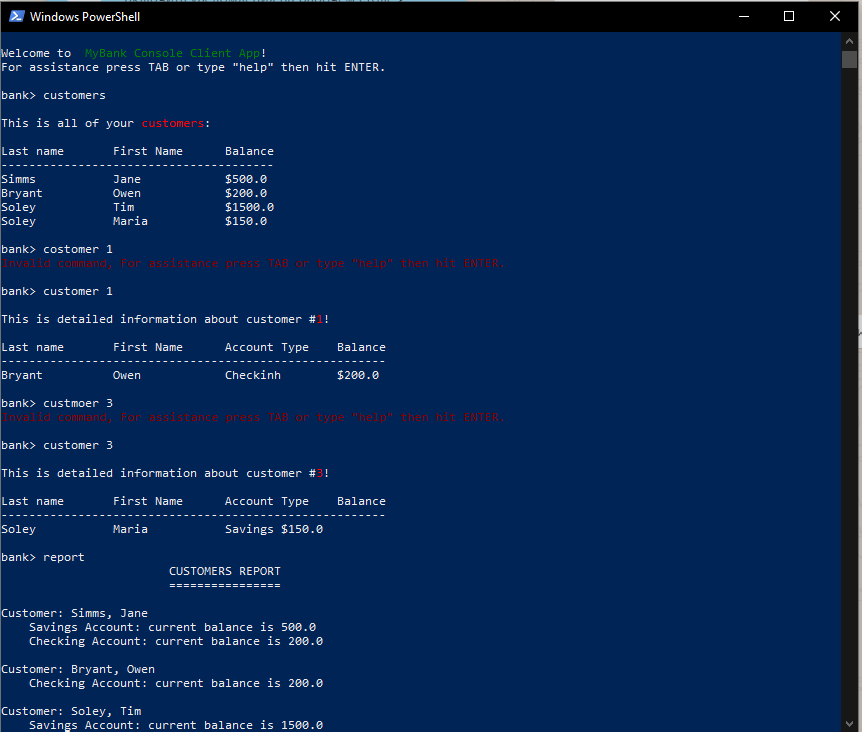

# UI Lab 2
 

## На "п'ять"
1. Додайте ще одну команду - **report**, яка має виводити звіт за клієнтами такого ж виду, як у роботі номер 8 (див. CustomerReport).
2. Запустіть проект, впевніться, що все працює як очікувалось. Продемонстрируйте результат викладачеві.
  
  
  

